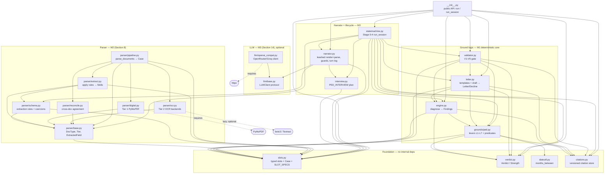

# Repo dependency graph (reference map)

Derived from the actual `from .` / `from ..` imports in `src/recovery_engine`.
Consult this before changing a module: edges point **from a module to what it
imports**, so an arrow `A --> B` means "A breaks if B's interface changes."
Regenerate the edge list any time with:

```bash
grep -rn -E "^\s*(from|import)\s" --include="*.py" src/recovery_engine \
  | grep -E "from \.|import \."
```

## Layered module graph



## Runtime data flow (the kernel, Section 4.1)

```
documents ──parse_documents()──► Case ──diagnose()──► Findings ──draft()──► Letter/Decline ──validate()──► gate
 parser/*      (M2)          slots.py     engine.py    (verdict +   letter.py    (V1-V5)    validator.py
                                          +grounds/ped  fired levers) +templates
                                          +citations
```

`run_session()` (statemachine.py) wraps this with Stage 0 eligibility, the Stage 2
interview (narrator + interview), the Stage 3 grievance/ombudsman fork, and the
Stage 4 evidence-sufficiency + validator gate.

## Module responsibilities & change-impact

| Module | Role | Imported by (blast radius) |
|---|---|---|
| `slots.py` | Typed slots, `Case`, `SLOT_SPECS`, anchors | **everything** — change with care |
| `verdict.py` | `Verdict`, `Strength`, `.allows()` (V4) | ped, engine, letter, validator, statemachine |
| `citations.py` | Versioned citation store, `resolve(rule, date)` | ped, engine, letter, validator, statemachine |
| `dateutil.py` | `months_between` (independent recompute) | grounds/ped |
| `grounds/ped.py` | Levers L1–L7, predicates (Section 6.3) | engine, letter, validator, statemachine |
| `engine.py` | `diagnose()` → `Findings` | letter, validator, statemachine, `__init__` |
| `letter.py` | Assertion templates, `draft()` | validator, statemachine, `__init__` |
| `validator.py` | V1–V5 pre-delivery gate | statemachine, `__init__` |
| `parser/base.py` | `DocType`, `Tier`, `ExtractedField`, `ParsedDoc` | all of parser/, statemachine |
| `parser/schema.py` | Extraction rules + coercions | parser/extract, narrator |
| `parser/pipeline.py` | `parse_documents()` orchestration | parser/`__init__` |
| `llm/base.py` | `LLMClient` protocol | llm/openai_compat, narrator |
| `interview.py` | `PED_INTERVIEW` slot plan | narrator, statemachine |
| `narrator.py` | Leashed render/parse + guards + turn log | statemachine, `__init__` |
| `statemachine.py` | `run_session()` Stages 0–4 | `__init__` |

## Where to change X

- **Add/adjust a legal lever or predicate** → `grounds/ped.py` (`LEVERS`, `evaluate`), then a template in `letter.py`, a citation in `citations.py`, and confirm `validator.py` still holds.
- **Add a citation / new effective-date version** → `citations.py` (`SEED_CITATIONS`) only; version selection is automatic.
- **Extract a new field from documents** → `parser/schema.py` (`_RULES`) + the slot in `slots.py` (`SLOT_SPECS`).
- **Add an interview question** → `interview.py` (`PED_INTERVIEW`); the narrator and state machine pick it up automatically.
- **Swap/limit the LLM** → `llm/` only; the narrator degrades to deterministic if it is absent.
- **Change eligibility, the fork, deadlines, or evidence rules** → `statemachine.py`.
- **A new denial ground (M8)** → new `grounds/<name>.py` replicating the PED shape; wire it into `engine.py` dispatch and add its interview plan.

## Not yet in the graph (later milestones)

`nexus/` (M4 — L3 currently reads a hand-supplied `nexus_absent` slot), an eval
harness (M5), a persistent deadline scheduler + fraud guard (M6), the
regulatory-freshness agent + precedent store (M7), and grounds 2–4 (M8).
